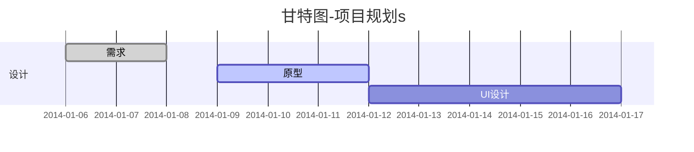
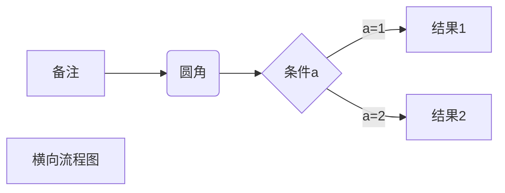
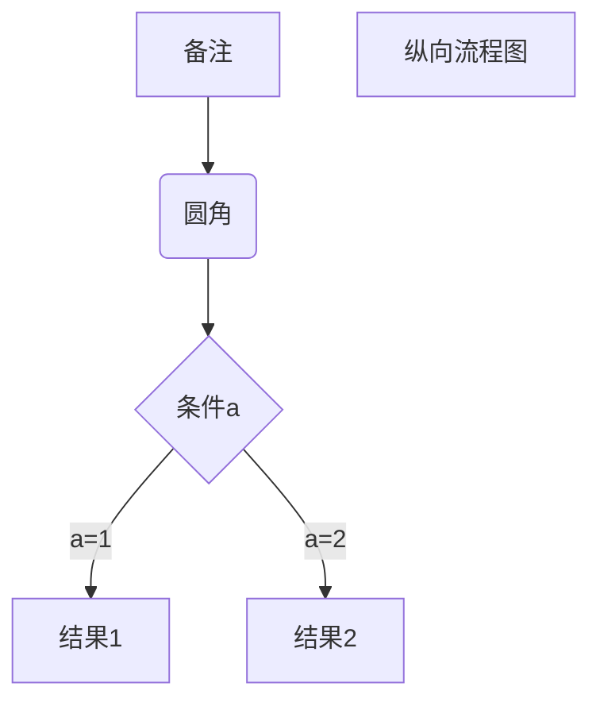

# markdown操作

## 格式

### 一、字体

**字体加粗**

*斜体*

~~删除线~~

***加粗斜体***

### 二、引用

> 输入 ">" 加空格。应用后回车再回车可以恢复正常

### 三、分割线

四次-或者四次+

++++


### 四、图片

 

叹号中括号小括号 中括号备注 小括号内放图片路径

### 五、超链接

[typora教学](https://www.bilibili.com/video/BV1c3411y7CX?spm_id_from=333.999.0.0)

中括号备注 小括号连接

### 六、列表

1.  数字加. 加空格生成列表
2.  

## 制图

### 一、甘特图



### 二、表格

| 列1  | 列2  |
| :--- | ---- |
|      |      |

```
表格 | 标题1 | 标题2 | 
```


### 三、数学公式

$$
\mathbf{V}_1 \times \mathbf{V}_2 = \begin{vmatrix}
\mathbf{i} & \mathbf{j} & \mathbf{k} \\

\end{vmatrix}
$$

更多数学公式看超链接52分钟内容

## 多媒体嵌入

### 一、视频嵌入

<iframe src="//player.bilibili.com/player.html?aid=421193880&bvid=BV1c3411y7CX&cid=426288565&page=1" scrolling="no" border="0" frameborder="no" framespacing="0" allowfullscreen="true"> </iframe>

视频嵌入可以通过视频下面的分享按钮查看嵌入的代码

### 二、音频嵌入

<audio id="audio" controls="" preload="none"><source id="mp3" src="这里改成自己想要放入的MP3文件的网络地址"></audio>


### 三、任务列表

- [ ]  asd

```
- [ ] 
```

### 四、画流程

#### 1.横向流程图




#### 2.纵向流程图



#### 3.标准流程图

```flow
st=>start: 开始框
op=>operation: 处理框
cond=>condition: 判断框(是或否?)
sub1=>subroutine: 子流程
io=>inputoutput: 输入输出框
e=>end: 结束框


st->op->cond
cond(yes)->io->e
cond(no)->sub1(right)->op
```

#### 4.时序图

1. 简单实例

```sequence
对象A->对象B: 对象B你好吗?（请求）
Note right of 对象B: 对象B的描述
Note left of 对象A: 对象A的描述(提示)
对象B-->对象A: 我很好(响应)
对象A->对象B: 你真的好吗
```

2. 复杂实例

```sequence
Title: 标题：复杂使用

对象A->对象B: 对象B你好吗?（请求）

Note right of 对象B: 对象B的描述

Note left of 对象A: 对象A的描述(提示)

对象B-->对象A: 我很好(响应)

对象B->小三: 你好吗

小三-->>对象A: 对象B找我了

对象A->对象B: 你真的好吗？

Note over 小三,对象B: 我们是朋友

participant C

Note right of C: 没人陪我玩
```

